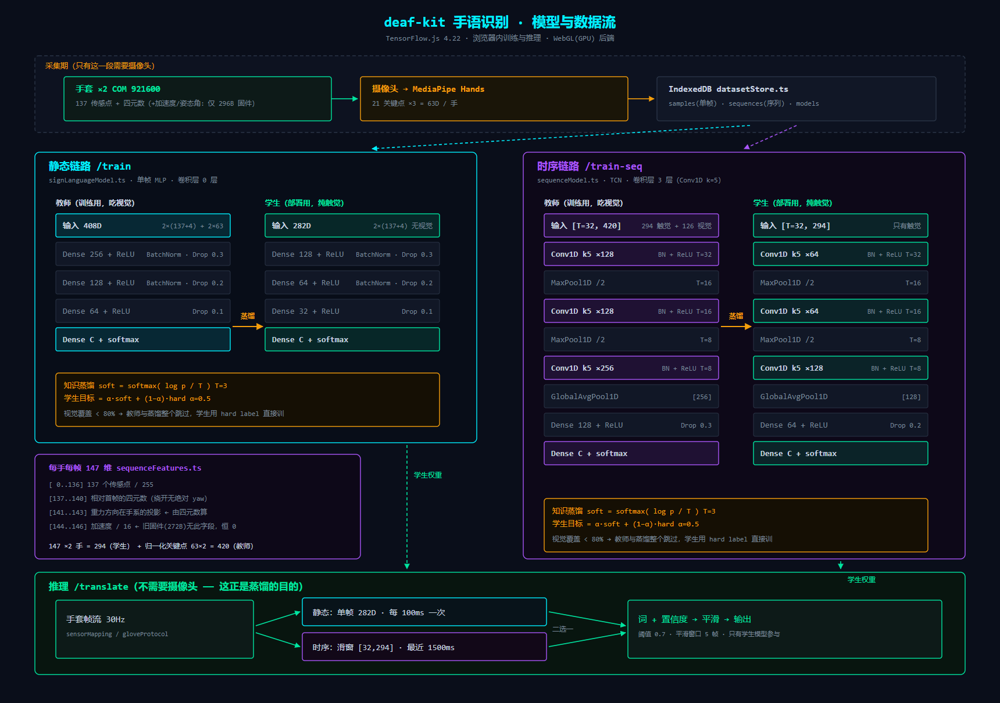

# 模型与数据流图

> 由代码核对生成（2026-08-13）。所有维度、层数、超参都是从源码读出来的，不是设计文档的口径。
> 改了模型请回来改这份图 —— 上一次就是因为文件头注释停在旧口径（写 204D，实际 408D）而误导人。



一张图版本：`模型结构图.svg`（矢量，插报告用这个）／`模型结构图.png`。
两者都由 `tools/gen_arch_svg.py` 生成 —— 改数字改脚本再跑一遍，不要手改 SVG。

框架：**TensorFlow.js 4.22**，浏览器内训练与推理，后端 `webgl`（= 显卡）。
拿不到 WebGL 时 tfjs 会**静默**回落 `cpu`，慢十几倍且不报错 —— 两个训练页标题旁的
`GPU · webgl` / `CPU · cpu` 徽标（`components/TfBackendBadge.tsx`）就是为此存在的。
句子级（连续手语）另有一条 **Keras / TensorFlow (Python)** 线：tfjs 4.22 没有 CTC loss，
`python_train/train_seq.py` 用 Keras 训完再由 `export_to_tfjs.py` 转回来。

---

## 0. 全局数据流

```
                        ┌─────────────── 采集期（要摄像头）───────────────┐
                        │                                                │
  手套 ×2 (COM, 921600) │   MediaPipe Hands ──► 21 关键点 ×3 = 63D/手     │
        │               │                                                │
        ▼               └────────────────────────┬───────────────────────┘
  gloveProtocol.ts                               │
  解析 137 传感点 + 四元数 + 加速度 + 姿态角      │
        │                                        │
        └────────────┬───────────────────────────┘
                     ▼
              IndexedDB (datasetStore.ts)
              ├── samples    单帧样本   → 静态链路
              ├── sequences  序列样本   → 时序链路
              └── models     两条链路的模型都存这里（靠 modelType 区分）
                     │
        ┌────────────┴────────────┐
        ▼                         ▼
   静态链路 /train           时序链路 /train-seq
   signLanguageModel.ts      sequenceModel.ts
   教师 408D → 学生 282D     教师 420D×T → 学生 294D×T
        │                         │
        └────────────┬────────────┘
                     ▼
              /translate 推理（**只用学生，不要摄像头**）
```

---

## 1. 时序链路（主线，动态词）—— TCN

`client/src/lib/sequenceModel.ts` + `sequenceFeatures.ts`

### 输入张量

```
教师 xs: [batch, T=32, 420]        学生 xs: [batch, T=32, 294]
ys:      [batch, numClasses] one-hot
```

每帧 147 维/手，左手在前右手在后（`sequenceFeatures.ts:22`）：

```
[  0..136]  137 个传感点 / 255
[137..140]  相对首帧的四元数 (w,x,y,z)      ← 相对量，绕开六轴没有绝对 yaw 的问题
[141..143]  重力方向在手系的投影（单位向量）
[144..146]  加速度 / 16，截断到 [-1,1]
            ← **只有 296B 固件（包2 = 168B）才有**；旧固件（272B / 包2 = 144B）
              `frame.acceleration` 为 null，这三路恒 0，等于白占 3 维
─────────────────────────────────────
 147 ×2 手 = 294  ← 学生（部署）到此为止
 + 63 ×2 手 = 126 归一化关键点  ← 只有教师有
 = 420
```

关键点先减手腕（平移不变）、再按手长 landmark 0→9 缩放，**承载手型而非画面位置**。

### 骨干 tcnBackbone —— 卷积一共 **3 层**

```
输入 [T=32, D]
  │
  ├─ b1: Conv1D(filters=c1, kernel=5, padding=same, useBias=false, heNormal)
  │      → BatchNorm → ReLU                                    T=32
  ├─ MaxPool1D(2)                                              T=16
  ├─ b2: Conv1D(c1, k=5) → BN → ReLU                           T=16
  ├─ MaxPool1D(2)                                              T=8
  ├─ b3: Conv1D(c2, k=5) → BN → ReLU                           T=8
  │
  └─(可选 backbone="tcn_bigru")Bidirectional(GRU(c2/2, returnSequences))
                                                    默认**不开**（浏览器训练太慢）
通道数    教师 c1=128, c2=256      学生 c1=64, c2=128
```

感受野（换算回原始帧）：`5 → 6 → 14 → 16 → 32`。**32 帧正好盖满整段**，
最后一层每个位置都看得到整个动作。

> 历史坑：原来这里用**空洞卷积**（dilationRate>1）。tfjs 前向支持、
> `conv2DBackpropInput/Filter` 不支持 —— 建模型、predict、tsc、build 全绿，
> 只有真跑 `fit` 才抛错。现在用「小核 + 池化」堆出同样的感受野，
> 并有 `sequenceModel.test.ts` 跑一步真 fit 把这个门守住。

### head（孤立词）

```
[T/4=8, c2] ─ GlobalAveragePooling1D ─► [c2]
             ─ Dense(hidden, relu, heNormal)
             ─ Dropout(教师 0.3 / 学生 0.2)
             ─ Dense(numClasses, softmax) ─► [numClasses]
hidden: 教师 128 / 学生 64
```

GAP 之前刻意保留时间维（T/4），将来接句子级逐帧 head 靠的就是这一段。

### 编译

```
optimizer  Adam(lr=0.001)
loss       categoricalCrossentropy
metrics    accuracy
```

---

## 2. 静态链路（旧线，单帧手型）—— 纯 MLP，**没有卷积层**

`client/src/lib/signLanguageModel.ts`

```
教师  in 408D  ─ Dense256+ReLU ─ BN ─ Drop0.3
               ─ Dense128+ReLU ─ BN ─ Drop0.2
               ─ Dense64 +ReLU ─      Drop0.1
               ─ Dense(C, softmax)

学生  in 282D  ─ Dense128+ReLU ─ BN ─ Drop0.3
               ─ Dense64 +ReLU ─ BN ─ Drop0.2
               ─ Dense32 +ReLU ─      Drop0.1
               ─ Dense(C, softmax)

408 = 双手触觉 2×(137 传感 + 4 四元数) 282  +  双手视觉 2×63 = 126
```

> 已知弱点：这条链路的关键点是 MediaPipe 的**绝对图像坐标**（`handVisual` 直接塞
> lm.x/y/z），没做手腕平移与手长归一。教师会把"手在画面哪个位置"当特征学进去，
> 再经蒸馏掺给学生。时序链路已绕开，静态链路要修得重训。

---

## 3. 知识蒸馏（两条链路同一套）

```
阶段 1  用带视觉的融合特征训教师
阶段 2  教师 predict → 概率 p
        soft   = softmax(log(p) / T)          T = distillationTemp = 3
        target = α·soft + (1−α)·hard          α = distillationAlpha = 0.5
        用 target 训学生（输入里没有视觉）

闸门：数据集视觉覆盖 < 80% → **整个教师与蒸馏跳过**，学生直接用 hard label 训
      （sequenceModel.ts:452 / signLanguageModel.ts:416）
```

`softmax(log(p)/T)` 恒等于对 logits 做 `softmax(z/T)` —— tfjs 拿不到 logits，
这是等价改写，不要"顺手改回来"。

验证集用**硬标签**：拿混合标签算出来的 val_acc 衡量的是"像不像教师"，不是"对不对"。

---

## 4. 骨架回归（旁支，喂 /mocap 的火柴人）

`client/src/lib/skeletonModel.ts`

```
in 141D（单手 137 传感 + 4 四元数）
  ─ Dense256+ReLU ─ BN ─ Drop0.2
  ─ Dense128+ReLU ─ BN ─ Drop0.15
  ─ Dense64 +ReLU ─      Drop0.1
  ─ Dense(63, sigmoid)          ← 21 关键点 ×3
loss  meanSquaredError
```

> 已知坏点：目标是 MediaPipe 的绝对坐标，而 **z 是以手腕为原点的相对深度、经常为负**，
> 配 sigmoid 输出永远够不到 → 深度通道等于废掉。2D 火柴人只画 x/y 所以看不出来。
> 要修得改归一化 + 换输出层 + 重训，已存骨架模型全部作废。

---

## 5. 核心函数一览（输入 → 输出）

### 特征层 `sequenceFeatures.ts`

| 函数 | 输入 | 输出 |
|---|---|---|
| `buildSequenceFeatures(sample, {seqLen, includeVision, augment})` | 一条 `SequenceSample` | `Float32Array[T×frameDim]` |
| `resampleSequence(...)` | 任意帧数 | 定长 T（短样本上采样，所以短录制也能训） |
| `synthesizeFromStatic(sample, cfg)` | 单帧静态样本 | 合成 `SequenceSample`（迁移旧数据） |
| `gravityInHandFrame(q)` | 四元数 | 重力单位向量（也被 `imuHealth` 复用） |

### 模型层 `sequenceModel.ts`

| 函数 | 输入 | 输出 |
|---|---|---|
| `planTrainValSplit(samples, cfg)` | 全部样本 | `{trainOrder, valOrder, trainSamples, valSamples}` — **按整条录制分组切**，验证集不含增强副本 |
| `buildSeqTeacher / buildSeqStudent(C, T, backbone, lr)` | 超参 | `tf.LayersModel` |
| `trainSequenceModel(samples, cfg, onProgress)` | 序列数据集 | `{teacherModel, studentModel, labels, 两个 accuracy, split}` |
| `predictSequence(window)` | `[T,294]` 触觉窗口 | `{label, confidence, allProbabilities}` |
| `serializeSequenceModel / loadSequenceModelFromSaved` | 模型 ↔ IndexedDB | `SavedModel` |

### 静态层 `signLanguageModel.ts`

| 函数 | 输入 | 输出 |
|---|---|---|
| `trainModel(samples, cfg, onProgress)` | 单帧数据集 | `{teacherModel, studentModel, labels, accuracy}` |
| `predict(frame)` | 一帧双手数据 | `{label, confidence, allProbabilities}` |

### 采集/驱动

| 函数 | 输入 | 输出 |
|---|---|---|
| `parseGloveFrame(bytes)` (`gloveProtocol.ts`) | 串口原始包 | `{sensor_data[137], quaternion, acceleration, attitude, hand}` |
| `getBendValues(sensor_data, hand)` (`sensorMapping.ts`) | 137 维 + 手别 | 5 指弯折 ADC（**左右手指序相反，必须走它**） |
| `bendRatios(raw, hand, range)` (`bendRange.ts`) | 原始 + 两点标定 | 5 指 0~1 弯曲度 → 3D 手模 |
| `applyOrientationCalib(q, calib)` (`orientationCalib.ts`) | 四元数 + 标定 | 校正后四元数 → 3D 手模朝向 |
| `analyzeImuHealth(samples)` (`imuHealth.ts`) | 四元数 + 加速度 | `{tiltInconsistencyDeg, verdict, reason}` 陀螺漂移自检 |
| `SequenceWindow` (`sequenceWindow.ts`) | 实时帧流 | 最近 1500ms 滑窗 `[T,294]` → 推理 |
